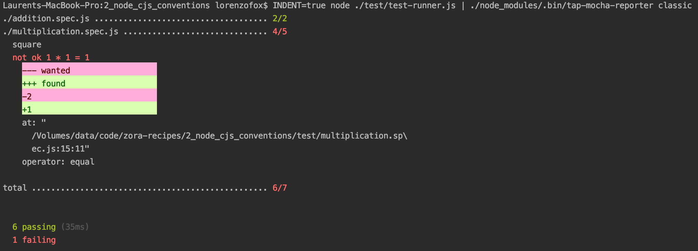

# discussion

## project scaffolding

A simple Nodejs library written in commonjs style with a source directory and a matching test directory.

Compared with the [first recipe](../1_node_cjs_simple), we are going to base our test experience on some conventions which will mirror the file system structure.
The file system is indeed a logical structure reflecting an organization of resources. When one creates a file ``./test/multiplication.spec.js``, you can reasonably assume this file will contain
code related to the testing of the ``multiply`` functionality (matching the ``./src/multiply.js``).  

### A test runner 

The workflow in this team requires a test file to export a single function taking as argument the zora's Assert object like so:

``./test/addition.spec.js``
```javascript
const {sum} = require(index.ts);

module.exports = (assert) => {
    const {test} = assert;
    test('sum two integers', t => {
        t.eq(sum(2, 2), 4, `2 + 2 = 4`);
        t.eq(sum(0, -2), -2, `0 + (-2) = -2`);
    });
};
``` 
You will have noticed you can't run straightly with Node a test file anymore: you will need a runner fulfilling the contract of calling the default export function of a spec file with a zora assert object.

This can be as simple as setting a entry point file as so:

``./test/test-runner.js``
```javascript
const {test} = require('zora');
test('./addition.spec.js', require('./addition.spec.js'));
test('./multiplication.spec.js', require('./multiplication.spec.js'));
```

Now if you run this file with node telling zora to produce an indented tap stream and using a reporter which understands the indented structure, 
you will get a nice structured output following the file system organization.
If you run ``INDENT=true node ./test/test-runner.js | tap-mocha-reporter classic``, you'll get the nice following output


This test runner is however not perfect: if you wish to run a specific test file, you will need either to comment out all the files you don't want to run either use the ``only`` method. You will also have to maintain the ``./test/test-runner.js`` file; 
with couple of files, it is pretty easy but when the projects grows it will become troublesome

Let's improve the test-runner by making it a basic CLI  

```javascript
#!/usr/bin/env node
const arg = require('arg');
const globby = require('globby');
const {createHarness} = require('zora');
const path = require('path');

const DEFAULT_FILE_PATTERN = ['./test/*.spec.js'];

(async function () {
    const {_: filePatternArg, ['--only']:runOnly} = arg({'--only':Boolean, '-o':'--only'}, {
        permissive: false,
        argv: process.argv.slice(2)
    });

    const filePattern = filePatternArg.length > 0 ? filePatternArg : DEFAULT_FILE_PATTERN;

    // create a custom test harness
    const testHarness = createHarness({
        indent:true,
        runOnly
    });
    try {
        const files = await globby(filePattern);
        for (const f of files) {
            testHarness.test(f, require(path.resolve(process.cwd(), f)));
        }
        // force indented reporting
        await testHarness.report();
    } catch (e) {
        console.error(e);
        process.exit(1);
    } finally {
        process.exit(testHarness.pass ? 0 : 1);
    }
})();
```

And voila. Now the team can create a package from this trivial test runner and force its organization to structure new projects based on some conventions. 
They can also include more features (reporters included, etc). Let's say they have published it under the name of ``tr``

Any new project will have the following ``package.json``
```json
{
  "scripts": {
    "test": "tr",
    "test:ci": "npm t",
    "test:coverage": "c8 npm t",
    "test:only": "npm t -- --only",
    "dev": "chokidar \"{test,src}/*.js\" -c \"npm t | tap-mocha-reporter classic\""
  }
}
``` 
At this point, as the test runner already includes quite few handy features (exit code, only mode, etc) you can actually simplify it: 

```json
{
  "scripts": {
    "test": "tr",
    "test:coverage": "c8 npm t",
    "dev": "chokidar \"{test,src}/*.js\" -c \"npm t | tap-mocha-reporter classic\""
  }
}
```
